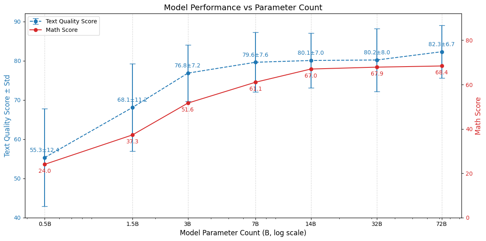
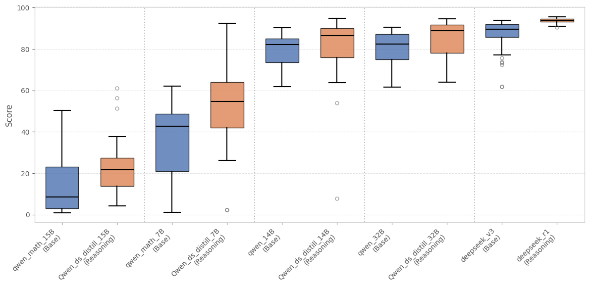
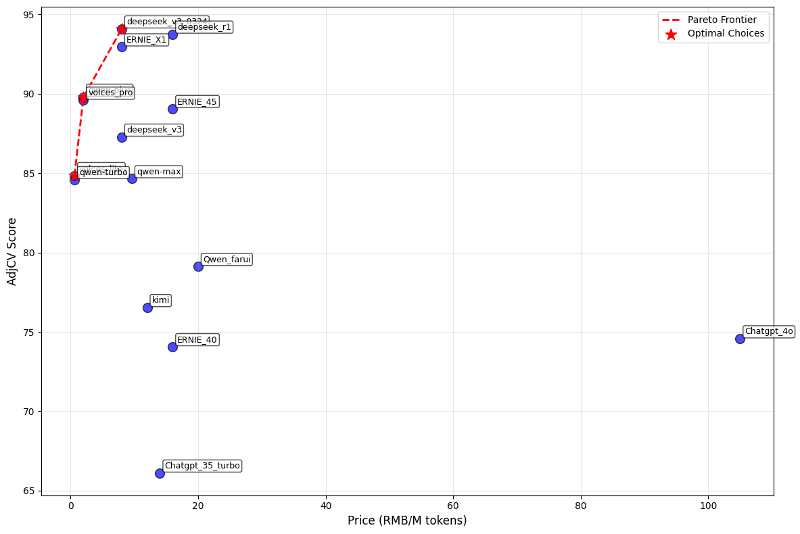

## 资源占用

python = 3.12.9;

磁盘占用约: 17G;

显存占用约:18G;

## 配置环境
```bash
pip install -r requirements.txt
```
## 模型下载

Qwen_7B_Review_Tuned_model : https://www.modelscope.cn/l424102993/LLM_TQ_Tuned_model.git

Regression_model_base : https://www.modelscope.cn/iic/nlp_bert_backbone_base_std.git

Regression_model_regression : https://www.modelscope.cn/l424102993/LLM_TQ_Regression_model.git

使用git下载(与魔塔sdk二选一)
```bash
cd data/models
git clone https://www.modelscope.cn/l424102993/LLM_TQ_Tuned_model.git
git clone https://www.modelscope.cn/iic/nlp_bert_backbone_base_std
git clone https://www.modelscope.cn/l424102993/LLM_TQ_Regression_model.git
```

使用魔塔sdk下载(推荐)
```python
#SDK模型下载
from modelscope import snapshot_download
model_dir = snapshot_download('l424102993/LLM_TQ_Tuned_model', cache_dir = "./data/models/")
model_dir = snapshot_download('iic/nlp_bert_backbone_base_std', cache_dir = "./data/models/")
model_dir = snapshot_download('l424102993/LLM_TQ_Regression_model', cache_dir = "./data/models")
## 替换其他路径
```
## 使用方式

### 1. 修改配置文件

修改配置文件 ./configs/config.ymal

根据下载模型的地址修改config.ymal的模型目录以及指定cuda号

### 2. 启动评分requests服务

2.1 直接使用bass启动request服务
```bash
bash serve.py
```

2.2 手动启动
如需指定虚拟环境或其他需求, 可手动启动 ./src/evaluator_request.py
注意手动启动时,可能需要修改evaluator_request.py里config.yaml的读取的相对路径, 以及config.yaml里模型的相对路径

### 3.添加API keys
在Evaluate_example.ipynb 对应位置添加Qwen的API Keys, 或自行修改相关代码以调用其他模型

### 4.模型测试
使用Evaluate_example.ipynb 进行单个模型单次的评分测试

## 批量评估

1.使用/notebooks/Evaluate_batch.ipynb 调用api接口或本地模型进行多个模型的评分测试

2.使用/notebooks/Generated_Result_Visualization_Analysis.ipynb可视化查看并对比分析结果

# 研究成果

## 模型质量的影响因素

### 模型参数量:7B-14B性价比最佳

受到模型训练方式以及训练数据集的影响, 模型的文本质量得分及其推理能力都在7B-14B时接近瓶颈. 



即在垂直领域的大模型部署时, 并不需要去追求模型过大, 因为其边际效应递减非常明显, 反而是模型的架构的更新或者原始数据集/微调数据集的质量会对其影响更大.

### 推理模型:推理模型优于普通模型

虽然已经有大量的论文论证的CoT的有效性以及推理模型的性能, 但是大多数的论证都是集中有推理模型在推理能力(指令遵从能力,数学能力等)的差异, 但是我们发现对于纯粹的输出文本的文本质量, 推理模型也会明显优于普通的模型.




## 最佳模型选择:

### 价格

不同的模型受其供应商和API渠道的影响在使用价格上表现出了较大的差距. 本实验对比了API的使用价格(RMB/1M tokens)和输出的文本质量. 在目前测试模型中, 性价比最高的为vocles-lite, qwen-plus 以及deepseek-v3-0324.



## 引用
```
@misc{yunhan2025legalevalqnewbenchmarkquality,
      title={LegalEval-Q: A New Benchmark for The Quality Evaluation of LLM-Generated Legal Text}, 
      author={Li yunhan and Wu gengshen},
      year={2025},
      eprint={2505.24826},
      archivePrefix={arXiv},
      primaryClass={cs.CL},
      url={https://arxiv.org/abs/2505.24826}, 
}
```
